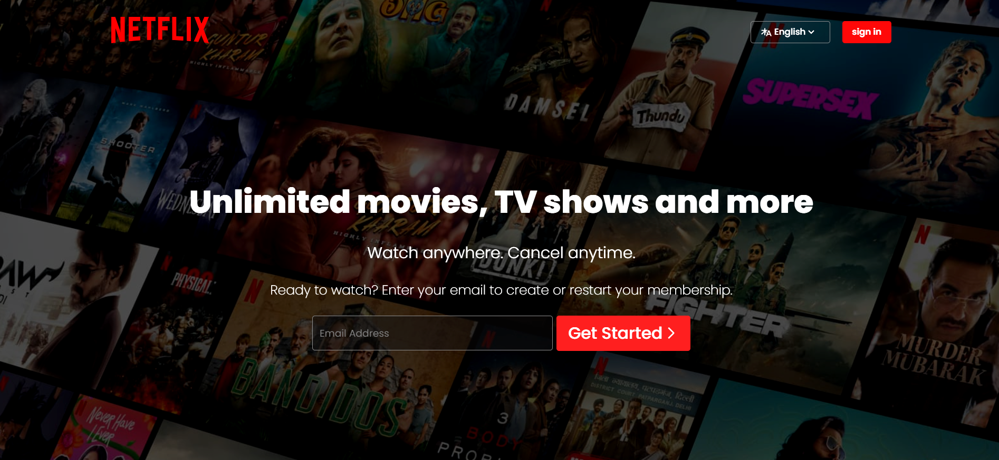

# Netflix Clone 🎬

A simple Netflix clone built using HTML and CSS. This project replicates the basic UI of Netflix, including a homepage with a hero section, a login button, and a featured movie trailer.

## Features ✨
- Netflix-style homepage
- Responsive design for different screen sizes
- Embedded video trailer
- Attractive UI with modern styling

## Technologies Used 🛠️
- HTML5
- CSS3

## Project Structure 📁
```
Netflix-Clone/
├── Netflix.html  # Main HTML file
├── Netflix.css   # Stylesheet for the project
├── assets/  # Contains background and logo images and Contains the featured movie trailer
└── README.md   # Project documentation
```

## How to Run the Project 🚀
1. **Clone the Repository**
   ```sh
   git clone https://github.com/your-username/netflix-clone.git
   ```
2. **Navigate to the Project Directory**
   ```sh
   cd netflix-clone
   ```
3. **Open `Netflix.html` in a Browser**
   - You can open it directly by double-clicking the file or using Live Server in VS Code.

## Screenshot 🖼️


## Future Improvements 🔧
- Add JavaScript for interactive features like movie carousels.
- Improve responsiveness for better mobile support.
- Implement a login and sign-up page.

## Contributions 🤝
Contributions are welcome! Feel free to fork the repository and submit pull requests.

## License 📜
This project is for educational purposes and does not claim ownership of Netflix's brand, content, or design.

---
💡 *If you like this project, don't forget to give it a star ⭐ on GitHub!*

